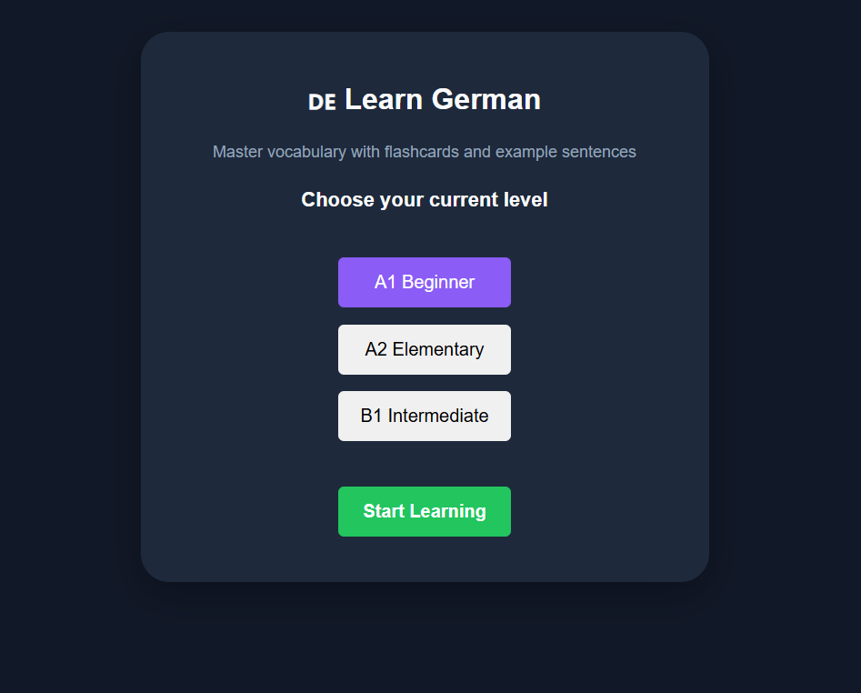
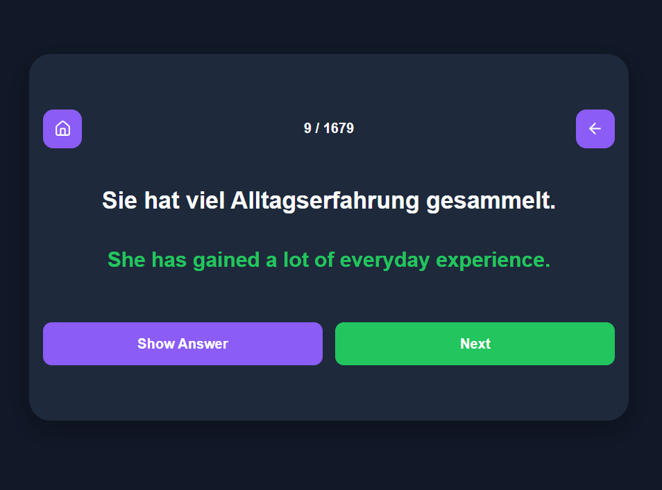

# 🇩🇪 DE Learn German

A modern German vocabulary learning application built with React.

I created DE Learn German to help me personaly in improving my German through flashcards, translations, and level-based vocabulary practice. The application focuses on practical vocabulary and example sentences from A1 to B1 levels.

---

## ✨ Features

* 📚 Learn German vocabulary through flashcards
* 🇩🇪 German sentence on the front
* 🇬🇧 English translation on the back
* 🎯 Level selection (A1, A2, B1)
* 📱 Fully responsive design for desktop and mobile
* 🔄 Navigate between flashcards
* 📊 Progress tracking during study sessions
* ⚡ Fast and lightweight React application

---

## 🚀 Demo

Coming soon.

---

## 🛠️ Built With

* React
* JavaScript (ES6+)
* CSS3
* Vite

---

## 📂 Project Structure

```text
src/
├── data/
│   ├── A1.json
│   ├── A2.json
│   └── B1.json
├── components/
│   ├── FlashCards.css
│   ├── FlashCards.jsx
│   └── SetupScreen.jsx
│   └── SetupScreen.jsx
├── App.jsx
├── main.jsx
├── App.css
├── index.css
```

---

## 📖 How It Works

1. Select your German level.
2. Start a study session.
3. Read the German sentence.
4. Reveal the English translation.
5. Move to the next flashcard.
6. Repeat and build vocabulary.

---

## 🎯 Levels

### A1 Beginner

Basic vocabulary and everyday expressions.

### A2 Elementary

Common phrases and everyday communication.

### B1 Intermediate

More advanced vocabulary and sentence structures.

---

## 📱 Responsive Design

The application is optimized for:

* Desktop
* Tablet
* Mobile devices

---

## 🔮 Future Improvements

* 🔊 Text-to-Speech pronunciation
* 🧠 Spaced repetition system
* 📥 Import custom flashcard decks

---

## 📸 Screenshots


### Setup Screen

Choose your German level before starting a study session.

### Flashcard Screen

Study vocabulary using German sentences and English translations.

---

## Author

Oussama Dalhi

Developer passionate about web development, new languages learning, and building useful applications.

---


