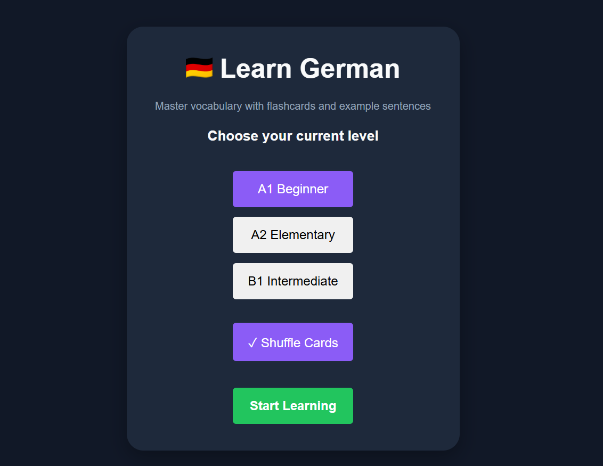
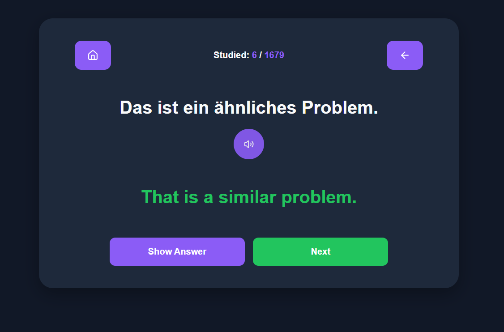
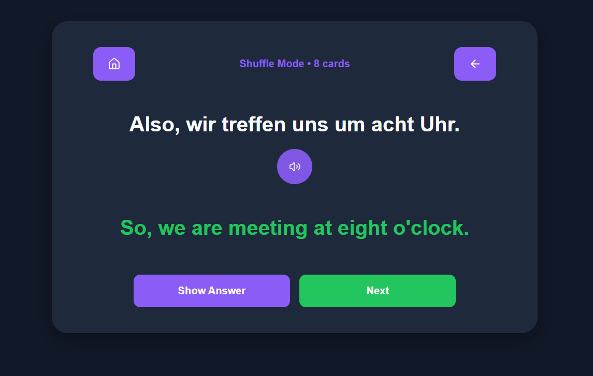

# 🇩🇪 DE Learn German

A German vocabulary learning application built with React to help learners improve their vocabulary through interactive flashcards, example sentences, and level-based study sessions.

I built DE Learn German to support my own German-learning journey while preparing for opportunities in Germany. The app focuses on practical vocabulary and real-world examples across A1, A2, and B1 levels.

## 🚀 Live Demo

https://de-learn-german.vercel.app/

## 📂 Repository

https://github.com/oussama-dalhi/de-learn-german

---

## ✨ Features

* German vocabulary flashcards with example sentences
* English translations for each card
* A1, A2, and B1 learning levels
* Voice pronunciation using the browser Speech Synthesis API
* Progress automatically saved with localStorage
* Shuffle Mode for randomized study sessions
* Separate progress tracking for Normal and Shuffle modes
* Responsive design for desktop and mobile devices
* Fast and simple user experience

---

## 🛠️ Built With

* React
* JavaScript (ES6+)
* CSS3
* Local Storage API
* Web Speech API

---

## 🧠 How It Works

1. Select a German level (A1, A2, or B1).
2. Choose between Normal Mode or Shuffle Mode.
3. Read the German sentence or vocabulary.
4. Listen to the pronunciation.
5. Reveal the English translation.
6. Move through the flashcards at your own pace.
7. Continue where you left off thanks to automatic progress saving.

---

## 📚 Learning Levels

### A1 – Beginner

Basic vocabulary, greetings, and everyday expressions.

### A2 – Elementary

Common phrases and practical communication for daily situations.

### B1 – Intermediate

More advanced vocabulary, grammar patterns, and sentence structures.

---

## 🎯 What I Learned

While building this project, I practiced:

* React state management with hooks
* Custom hooks using localStorage
* Data persistence across sessions
* Browser Speech Synthesis API
* Flashcard application design
* Implementing the Fisher–Yates shuffle algorithm
* Managing separate application states for different study modes
* Responsive UI development

---

## 🔮 Future Improvements

* Spaced repetition system (SRS)
* Custom flashcard imports
* User-created vocabulary decks
* Study statistics and analytics
* Search and filter functionality
* Dark mode

---

## 📸 Screenshots

### Setup Screen

### Normal Mode

### Shuffle Mode

---

## 👨‍💻 Author

**Oussama Dalhi**

Frontend Developer passionate about web development, language learning, and building practical applications.

